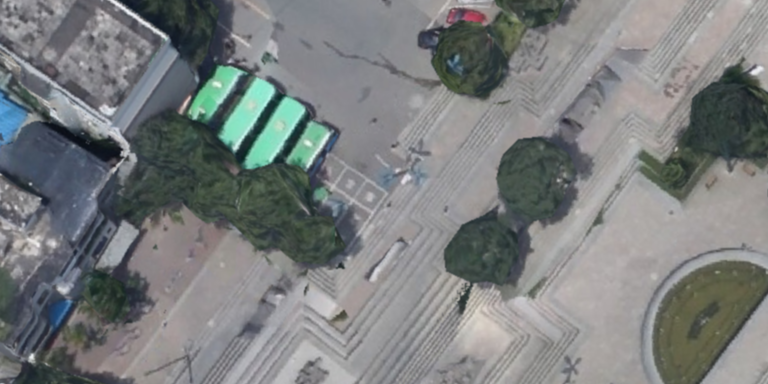
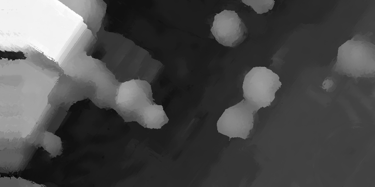
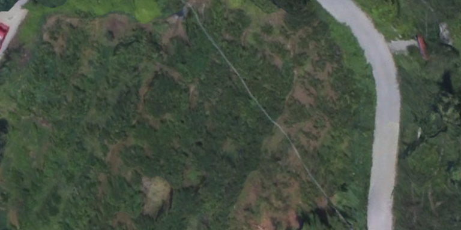
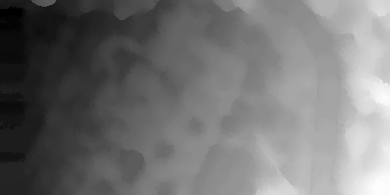

# PatchMatchStereo_CUDA

​                       

​                       

## Introduction

A modified GPU-accelerated pm-stereo red/black modified version  for 3d reconstruction.(Note: This is not original PM-STEREO algorithm)

For the idea, you could check gipuma paper and their project:

https://github.com/kysucix/gipuma

## Compilation

The algorithm was verified in a subset of WHU-Stereo dataset,you could download them here:

https://github.com/Sheng029/WHU-Stereo

The code is first written in Windows in 1080ti,and also test in 3060 with my laptop,but there's no extra change are needed to transport to Linux system.

CUDA 11.0 or above is required,the code is self-contained so you don't need any 3rd library.

In order to use std::filesystem,which is optional to find the path without dependency, you make want to set language standard to

"-std=c++17 -Xcompiler "/std:c++17"

You should compute a depth map in WHU-Stereo in 8-10s within 8 iteration, which have 100x-500x speed up than original Patch-Match Stereo CPU implementation.  

## TODO

There's a technical talk that a Row parallel modification of patch match stereo is actually used to generate real outdoor scene 3d information with satellite data using intel One API by Intel developers, the link with Chinese subtitle is here:

https://www.bilibili.com/video/BV1uh411b7Sj/

The Repo aim to update this algorithm soon.

## Paper Link for study

Original Patch-Match Stereo:http://www.bmva.org/bmvc/2011/proceedings/paper14/paper14.pdf

RB-Modified Patch-Match for Multiview dense reconstruction:

http://www.prs.igp.ethz.ch/content/dam/ethz/special-interest/baug/igp/photogrammetry-remote-sensing-dam/documents/pdf/galliani-lasinger-iccv15.pdf

Row-Parallel Patch-Match for Multiview dense reconstruction:

https://openaccess.thecvf.com/content_cvpr_2014/papers/Zheng_PatchMatch_Based_Joint_2014_CVPR_paper.pdf

